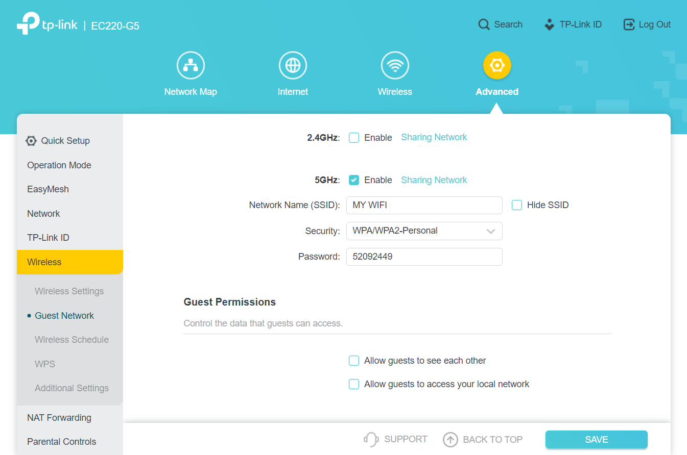
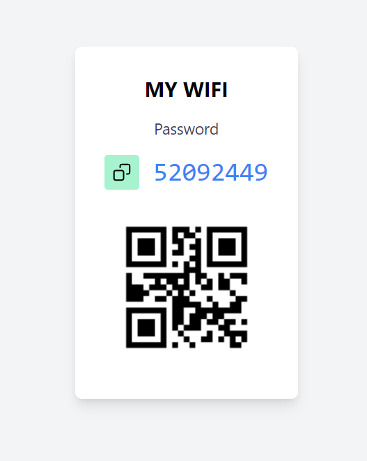

# auto-guest-change
A automatic **guest password** changer &amp; updater for **TP-Link EC220-G5** Router.

This project automates the process of changing the guest network password of a router using Selenium and Python. It also includes a Flask server to store and retrieve the new password.


## Features

1. **Automated Password Update**:
   - Generates a secure passkey using SHA-256 hashing.
   - Adjustable passkey length and character set.
   - Alternate character styles for simplicity.
   - Logs into the router's admin panel and updates the guest network password.
   - Uses Selenium's headless mode for smooth automation without GUI.
   - use `single_run.py` for using only one time.
   - use `multi_run.py` for running the script again & again after an **interval**.

3. **Flask Server for Password Management**:
   - Saves the new passkey in the server.
   - Provides endpoints to retrieve and update the passkey.
   - Homepage with autorefresh to show the latest password.
   - You can host it anywhere.


## Installation

### Prerequisites

- Python 3.8 or higher
- Google Chrome and ChromeDriver
- Flask (`pip install flask`)
- Selenium (`pip install selenium`)
- Requests library (`pip install requests`)

---

## Configuration

### Script Configuration

Edit the following variables in the script to match your router and server settings in `single_run.py`:

```python
router_login_page = 'http://192.168.0.1'  # Router login page URL
router_password = 'YourRouterPassword'    # Router admin password
server_url = 'http://localhost:5000/set_new_key'  # Flask server URL
server_password = 'YourServerPassword'    # Server authentication password

# Passkey settings
characters = '0123456789abcdefABCDEF'  # Passkey character set
length = 8                             # Length of the passkey
frequency = PasswordFrequency.MINUTE   # Passkey generation frequency
password_styles = PasswordStyle.FOUR_ALTERNATE  # Passkey style
```

Edit the time interval for running the script repeatedly in `multi_run.py`

```python
time_period = 60 * 10 # 10 minutes
# set the time_period to 60 * 60 for 1 hour
# set the time_period to 60 * 60 * 24 for 1 day
# set the time_period to 60 * 60 * 24 * 7 for 1 week
# set the time_period to 60 * 60 * 24 * 30 for 1 month
# set it as you like
```

---

### Flask Server Configuration

Edit the following variables in the Flask server code:

```python
password_file = "pass.txt"              # File to store the passkey
server_password = "YourServerPassword"  # Authentication password
TITLE = "MY WIFI"                       # Web page title
```

---

## Usage

### Running the Script

1. Install the required Python libraries.
2. Update the script configuration as described above.
3. Run the script:
   
   For single run :
   ```bash
   python single_run.py
   ```
   For repeated runs :
   ```bash
   python multi_run.py
   ```

### Running the Flask Server

1. Install Flask (`pip install flask`).
2. Run the Flask server:

   ```bash
   cd ./server
   python app.py
   ```

3. Access the server via `http://localhost:5000`.

---

## Flask Server Endpoints

### 1. **Set New Passkey** (`POST /set_new_key`)

- **Description**: Updates the passkey stored on the server.
- **Request Body**:
  - `password` (string): Authentication password.
  - `new_key` (string): New passkey to store.
- **Response**:
  - `200 OK`: Passkey updated successfully.
  - `400 Bad Request`: Invalid password or missing key.

### 2. **Get Passkey** (`GET /get_key`)

- **Description**: Retrieves the saved passkey.
- **Response**:
  - `200 OK`: Returns the passkey as JSON.

### 3. **Home Page** (`GET /`)

- **Description**: Displays the current passkey on a web page.

---

## Screenshots

| Router page | Flask Server |
|------------|-------------|
|  |  |

## Limitations

- The script assumes specific router interface element IDs and classes, which may vary between router models.
- The default router admin URL and credentials must be manually configured.
- This repo is mainly focused for **TP-Link EC220-G5** Router.
---

## License

This project is licensed under the MIT License. See the [LICENSE](LICENSE) file for details.

## Contributing

Feel free to fork this repository and submit pull requests to enhance functionality or fix issues.

